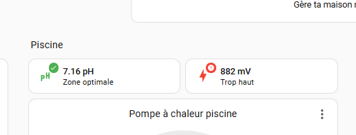

# Syclope HydroTouch CHY0444 → Home Assistant

Guide complet et reproductible pour intégrer un régulateur de piscine **Syclope HydroTouch CHY0444** dans **Home Assistant** via son port **RS485 Modbus RTU**, un serveur série **Waveshare RS232/485/422 TO POE ETH (B)** et un transport **RTU over TCP**.



## Résultat validé

| Mesure | Registre PLC | Adresse 0-based | Type | Décodage |
|---|---:|---:|---|---|
| pH | `41203` | `1202` | `float32` | mots inversés `CDAB` / `swap: word` |
| Redox | `41303` | `1302` | `float32` | mots inversés `CDAB` / `swap: word` |

La lecture a été vérifiée simultanément sur l’écran du Syclope et par logiciel : environ **7,17 pH** et **882 mV**.

## Contenu du dépôt

- `index.html` : site statique complet
- `guide.md` : source éditable du guide
- `assets/` : photos, captures, schémas et CSS
- `scripts/` : outils Python de test, scan et analyse
- `home-assistant/` : configuration Modbus et cartes Mushroom
- `data/` : scans CSV, rapport de rétro-ingénierie  et cartographie
- `PUBLICATION.md` : notes de  et  de publication
- `vercel.json` : configuration de déploiement Vercel
- `publish.ps1` : publication GitHub + Vercel depuis Windows

## Aperçu local

Le site est entièrement statique. Ouvrez directement `index.html`, ou lancez un petit serveur local :

```powershell
python -m http.server 8000
```

Puis ouvrez `http://localhost:8000`.

## Déploiement sur GitHub et Vercel

### Option automatisée sous Windows

Installez les outils une seule fois :

```powershell
winget install --id GitHub.cli
npm install --global vercel@latest
```

Authentifiez-vous :

```powershell
gh auth login
vercel login
```

Depuis la racine du projet :

```powershell
.\publish.ps1
```

Le script effectue d’abord un contrôle de  sur les fichiers texte, puis :

1. initialise Git si nécessaire ;
2. crée un commit ;
3. crée le dépôt GitHub public `syclope-hydrotouch-home-assistant` ;
4. pousse la branche `main` ;
5. effectue un déploiement Vercel de production.

Pour choisir un autre nom ou un dépôt privé :

```powershell
.\publish.ps1 -Repository "mon-nom-de-depot" -Visibility private
```

### Option via les interfaces web

1. Créez un dépôt GitHub vide.
2. Poussez ce dossier sur la branche `main`.
3. Dans Vercel, choisissez **Add New → Project**.
4. Importez le dépôt GitHub.
5. Gardez **Framework Preset: Other**, sans commande de build.
6. Cliquez sur **Deploy**.

Chaque futur `git push` déclenchera alors automatiquement un nouveau déploiement.

## Avertissement de sécurité

Cette documentation décrit une expérience réelle, mais elle ne remplace ni la notice constructeur ni l’intervention d’un professionnel qualifié. Le montage combine secteur 230 V, basse tension, produits chimiques et pompes de dosage. Toute intervention doit être réalisée hors tension, avec les protections et méthodes adaptées. L’intégration Home Assistant présentée est volontairement **en lecture seule**.
